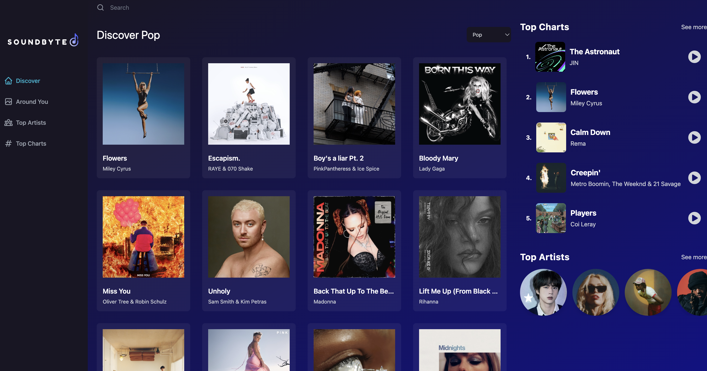

<h1 align='center'> :notes:  SoundBytes  :notes: </h1>

 A music player web app specializing in short previews, allowing users to discover new music faster than ever before. 

 Web Preview 

 

Mobile Preview 

 

 Soundbyte was built using JavaScript, <a href="https://reactjs.org/">React.js</a>, <a href='https://react-redux.js.org/'>Redux</a>, <a href='https://tailwindcss.com/'>Tailwind CSS</a>, <a href='https://rapidapi.com/'> RapidAPI</a>, and deployed through <a href='https://www.netlify.com/'>Netlify</a>

## Deployed Site :desktop_computer:
  Check out <a href='https://soundbyte.netlify.app/'> Soundbyte! </a> :point_left:

## Developer :wrench:
 * Eric Jiang - [GitHub](https://github.com/ericyjiang) :computer: | [LinkedIn](https://www.linkedin.com/in/ericyjiang/) :handshake:
 
## Features
* Top Chart Songs & Top Artists from Shazam's API
* Top Songs In Your Country (Geolocation API)
* Song Details With Lyrics & Related Songs
* Search Bar
* Responsive Design
* Custom Built Music Player
* Auto Playing The Next Song

## Future Roadmap :crystal_ball:
* Adding User Accounts To Save Favorite Songs & Artists
* Adding Friend's List To See What Your Friends Are Listening To
* Adding Playlists
